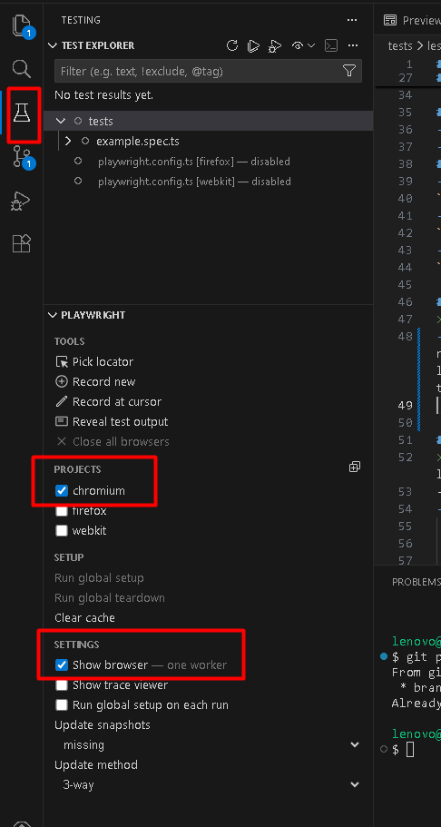
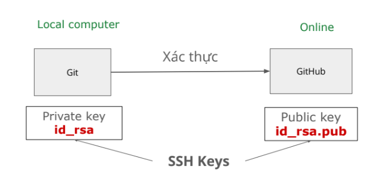

# Lesson 01 
## Playwright là gì?
- Là 1 framework
- Tiền thân là Puppeteer, được Microsoft tài trợ và phát triển lên
- https://playwright.dev/
- Ra đời 31/01.2020
- Version mới nhất v1.57
## Ưu điểm Playwright
- **Cross browser**
    - Hỗ trợ các trình duyệt phổ biến: Chrome, Edge, Firefox, Safari
    - Hỗ trợ lên tới 143 phiên bản trình duyệt
- **Cross platform**
    - Code 1 lần, chạy trên các hệ điều hành phổ biến: Windows, Linux, MacOS
- **Tính năng xịn sò**
    - **auto waiting, auto-retry assertion** giúp **giảm flaky test** (lúc pass, lúc fail)
- **Report đầy đủ thông tin**
    - Pass/fail theo từng loại trình duyệt
    - Chi tiết ở từng thời điểm: "gọi API nào", "response trả về gì", "ứng với dòng code nào"
- **Code gen**
    - Thao tác để sinh ra code
## Học Playwright vì:
- Dễ cài đặt
- Cú pháp đơn giản, dễ học
- Framework trending, nhiều cơ hội việc làm.
- Học tư duy, hiểu bản chất thì các tools tương tự nhau

## NVM
- **NVM** = Node Version Manager = quản lý các phiên bản NodeJs
- **NodeJs** = Công cụ để chạy code
- 2 options:  
    - Cài trực tiếp NodeJs vào máy
    - Cài thông qua NVM
    > Chọn thông qua NVM vì: dễ chuyển đổi nhiều phiên bản NodeJs (các dự án khác nhau có thể làm ở NodeJs version khác nhau)

## Git & GitHub
- **Git**: quản lý source code
- **GitHub**: chia sẻ code, làm việc nhóm
### Cấu hình Git
- Config **username**
`git config --global user.name "<tên bạn>"`
- Config **email**
`git config --global user.email “<email của bạn>”`
- Config **branch default**
`git config --global init.defaultBranch main`

## VS Code = IDE = integrated development enviroment
> là công cụ để viết code
- Cài đặt thêm **extension**: `Playwright` -> xuất hiện hình phễu thí nghiệm bên góc trái màn hình -> kéo tab Playwright mở rộng (kéo từ dưới lên trên) -> **Projects**: chỉ tick `chromium` ->  **Settings:** chỉ tick `Show browser`

### Đổi terminal mặc định
> Window Powershell là terminal mặc định trên Windows, hay bị chặn/ lỗi lặt vặt
-> dùng Git Bash để tránh lỗi
- Đổi terminal mặc định trong VS Code: 
    1. Ctrl + Shift + P
    2. Tìm kiếm: terminal default
    3. Chọn: `Terminal: Select Default Profile`
    4. Chọn `Git Bash`
    5. Kiểm tra lại bằng cách mở terminal (Ctrl Shift `) -> ra Git Bash là đúng
### Kết nối với GitHub

- **SSH key**: cặp khóa (2 cái)
    -  `id_rsa` và `id_rsa.public`
    - `id_rsa`: cần giữ bí mật
    -`id_rsa.pub`: có thể gửi cho người khác
- SSH key giúp xác thực đăng nhập dễ hơn.
- Lưu ở ~/.ssh
- "~" đại diện cho thư mục **home**
- **Home** ở Windows: 
C:\Users\{username}
- **Home** ở Linux/MacOS: 
/Users/{username}
- Lệnh tạo **SSH Keys**
`ssh-keygen -t rsa -b 4096 -C
"your_email@example.com"`
- Lấy nội dung ssh key: `cat ~/.ssh/id_rsa.pub`
- Truy cập: https://github.com/settings/ssh/new    để thêm ssh key

## Cài đặt Playwright
1. Tạo 1 folder 
2. Mở folder bằng VS Code
3. Mở terminal
4. Chạy lệnh `npm init playwright@latest`
-> liên tục gõ enter cho tới khi được báo dòng **Happy hacking!**

## Đưa code lên GitHub: tạo repo
- **Tạo repo on Github Web**
1. Truy cập: https://github.com/new
2. Điền tên repo
3. Chọn Public
- **Khởi tạo**:
1. Khởi tạo repo local **(làm 1 lần duy nhất)**
`git init`
2. Tạo repo Github và liên kết tới repo local **(làm 1 lần duy nhất)**
`git remote add origin <url>`
**từ step 3 - làm mỗi khi có thay đổi**
3. Thêm file vào staging
`git add .` or `git add <file_name>`
4. Commiy file
`git commit -m "<message>"`
> thường commit đầu tiên, message luôn là: "init project"
5. Push code
`git push origin main`
## Github: Invite collaborators
1. Truy cập repo setting:
`https://github.com/<username>/<repo_name>/settings/access`
2. Add collaborator
