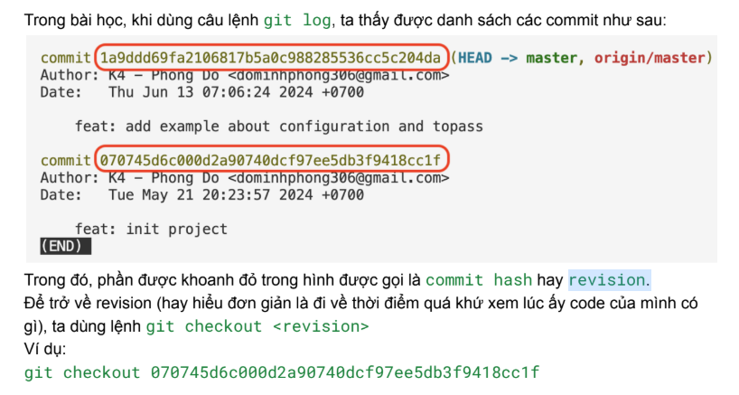

# Lesson 3

## Git
### Undo actions
- Change commit message:
    - 1st way: `git commit --amend "new message"`        
    - 2nd way: `git commit --amend`
        - Type "i": to open insert mode
        - Type "esc": to exit insert mode
        - Type ":wq": write and quit
        - Type ":q": quit

- `git restore --staged <file>`
Transfer file(s) from staging area to working directory area : 


### Un-commit
- `git reset HEAD~N` (undo N commit) N = 1, 2, 3,...
Transfer file(s) from repository area to working directory area (uncommit)
- Commit đầu tiên không thể bị reset.
- Nếu muốn reset → xoá thư mục *.git* đi rồi *init* lại
- `git log` -> check danh sách commit
- `git status`: kiểm tra trạng thái files

### Pull code
`git pull origin main` lấy code từ server về

### Branching model
- Git sử dụng nhánh (branch) để tạo ra các “phiên bản” riêng của code,
tránh ảnh hưởng tới “bản gốc”
- Khi khởi tạo repo (git init), nhánh mặc định sẽ được tạo ra
- `git config --global init.defaultBranch main`
    > cấu hình: khi khởi tạo, đặt nhánh mặc định là nhánh main
- `giit branch`: show branch list
    > Cần có ít nhất 1 commit mới hiện danh sách nhánh
- `git branch <branch name>` : tạo branch mới   
    > Nhánh mới “copy” giống hệt nhánh hiện tại
- `git checkout <branch_name>`: switch branch
- `git checkout -b <name>`: Vừa tạo, vừa chuyển sang nhánh mới
- `git branch -D <branch name>`: delete branch
    > đứng ở nhánh khác trước khi xoá
- Luôn pull code về trước khi tạo nhánh mới
### Ignore file
- `.gitignore` = Git Ignore: Dùng để bỏ qua các file không cần git theo dõi.
    - Ignore file:
        `<file_name>`
    - Ignore folder:
        `<folder-name>/`
- Trong dự án thường có nhiều file không cần thiết phải đưa vào Git repository, ví dụ:
    - File tạm thời của hệ điều hành (.DS_Store, Thumbs.db) 
    - Thư mục dependencies (node_modules/, vendor/) 
    - File build và artifacts (dist/,build/, *.exe)
    - File cấu hình cá nhân (IDE settings, environment variables)
    - File nhạy cảm (API keys, passwords, certificates)
    - File log và database local
### Revision (commit hash)


## Javascript
### Convention
- snake_case_name : tạm thời không dùng
- kebab-case-name : đặt tên file và folder
- camelCaseName : đặt tên biến, hàm
- PascalCaseName : đặt tên class

### console.log
> giúp debug và theo dõi code
```typescript
console.log('Toi la Nga');

console.log("Toi la Phong");

console.log(`${variable_name}`);

let name = "Nga";
console.log(`Toi la ${name}`);

console.log("Toi ten la" + name + " ");
```

### Object
- Object: là đối tượng, dùng để lưu trữ tập hợp các giá trị vào cùng 1 biến/ hằng số
- Khai báo:
``` typescript
    let/const <ten_object> = {
        <thuoc_tinh>: <gia_tri>,
        …
    }
    // giá trị có thể là biến hoặc 1 object khác
```
- Ví dụ:
``` typescript
    let user = {“name”: “Alex”, “age”: 10, “email”: “alex@gmail.com”}
    const product = {
            “name”: “Laptop”,
            “price”: 500,
            “isWindow”: true,
            “manufacturer”: {
                “name”: “Acer”,
                “year”: 2024
    }
```
- Sử dụng:
``` typescript
    console.log("name = " + user.name);
    console.log("manufacturer name = " + product.manufacturer.name);
    console.log("price = ", product[“price”]);
```
- Gắn lại giá trị: **cả let và const đều gắn lại value khác được. Nhưng không thể khai báo đè lại**
    - `user.age = 28`
    -` product[“manufacturer”][“year”] = 2025`
    - Can't use: 
    ``` typescript
        const product = {
            ...
            “manufacturer”: {
                ...
                “year”: 2025
        } 
    ```
- Như ta đã biết, khi dùng const (hằng số), thì giá trị sẽ không thay đổi được. Ví dụ:
    ``` typescript
        const a = 10;
        a = 15; // lỗi
    ```
    Đối với object cũng vậy, nếu bạn thay cả object bằng một object mới, bạn cũng sẽ gặp lỗi. Ví dụ:
    ``` typescript
        const student = {“name”: “alex”, “age”: 20}
        student = {“name”: “Nagi”, “age”: 18} // lỗi
    ```
    Tuy nhiên, nếu bạn chỉ thay đổi các thuộc tính của object thì hoàn toàn hợp lệ. Ví dụ mình sẽ
    chỉ thay giá trị của name trong object student:
    ``` typescript
    const student = {“name”: “alex”, “age”: 20}
    student.name = “Nagi”; // Hợp lệ
    ```
- **Để thêm thuộc tính mới vào object**, chúng ta chỉ cần dùng dấu . hoặc ngoặc vuông [] để định
nghĩa thuộc tính mới. Ví dụ:
    ``` typescript
    let bike = {
        make: 'Yamaha',
        model: 'YZF-R3'
    };
    bike.color = “Blue”;
    bike[“price new”] = 100;
    console.log(bike);
    {make: 'Yamaha', model: 'YZF-R3', color: 'Blue', ‘price new’ : 100}
    ```
- **Để xóa thuộc tính của object**, chúng ta dùng hàm delete:
    ``` typescript
    let employee = {
    name: 'Le Van C',
    age: 30,
    department: 'HR'
    };

    delete employee.age;
    console.log(employee);
    Kết quả:
    {name: 'Le Van C', department: 'HR'} 
    ```   
### Logical operator
    - `&&`: cả 2 vế mệnh đề đều đúng
    - `||`: 1 trong 2 vế mệnh đều đúng
    - `!`: đảo ngược value, example: !a, !!b

### Array
- Khai báo: a = [1, 2, 'a', false, true]
- Độ dài mảng: `a.length`
- Lấy phần tử theo index: `a[0]`, `a[1]`
- **Để thêm phần tử vào mảng**, ta dùng hàm `push`
Ví dụ:
```typescript
const arr = [1,2];
arr.push(3);
console.log(arr);
// Kết quả in ra
[1, 2, 3]
```
### Function
- Function = hàm: là 1 đoạn code được đặt tên, có thể tái sử dụng, thực hiện 1 phép tính hoặc nhiệm vụ cụ thể
- Khai báo:
```typescript
function <nameFunction>() {
    // code
}
```
- Parameter: `nameFunction(para1, para2)`
- Return value: 
```typescript
function ABC() {
    return 10
} 
```

### Loop
- Vòng lặp lồng nhau là khi bạn đặt một vòng lặp bên trong một vòng lặp khác. Điều quan trọng cần hiểu:
**mỗi lần vòng lặp ngoài chạy 1 lần, vòng lặp trong phải chạy HẾT tất cả các lần của nó.**
- Điểm quan trọng cần nhớ: 
    1. Vòng trong reset mỗi lần: Vòng lặp trong luôn bắt đầu lại từ giá trị khởi tạo mỗi khi vòng ngoài chạy
    2. Số lần thực thi: Vòng ngoài chạy n lần, vòng trong chạy m lần → Tổng = n × m lần
    3. Thứ tự thực thi: Luôn là vòng trong chạy hết trước, rồi vòng ngoài mới tiếp tục
    4. Biến độc lập: Mỗi vòng lặp cần biến riêng (i, j, k,...)