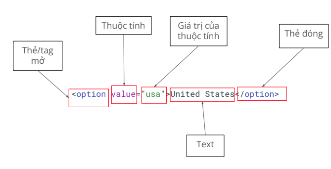
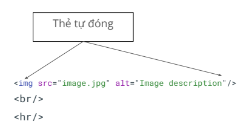
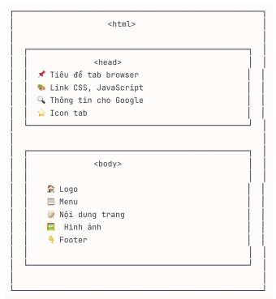
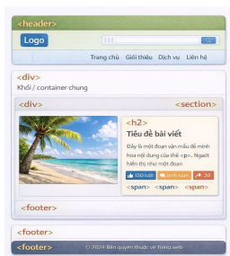
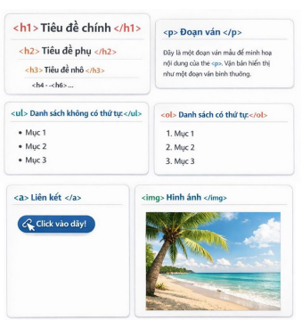
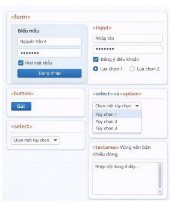
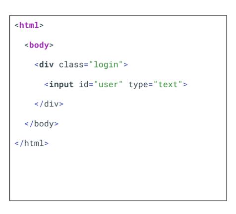
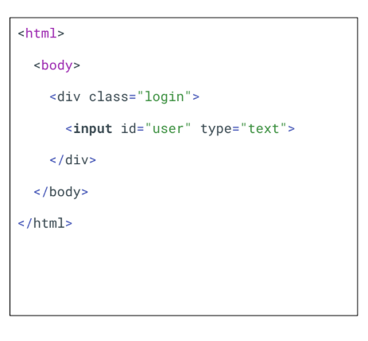
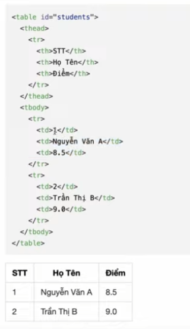

# Lesson 5
## Javascript - Function Advance
### Function Expression (Biểu thức hàm)
> Định nghĩa bằng cách gán cho nó một biến
```typescript
// Function Declaration (khai báo hàm)
function add(a,b) {
    return a + b;
}

//Function Expression 
const add = function(a,b) {
    return a + b;
}

const str = function(name) {
    return `Hello ${name}`;
}

const num = function(price, quantity, discount) {
    return price * quantity - discount;
}

```

## Lambda Function (Arrow Function)
- Xuất hiện lần đầu trong ES6 (ES2015)
- cách viết ngắn gọn hơn cho function
- sử dụng dấu =>
- Có dạng cú pháp ngắn gọn nhất (implicit return)

``` typescript
// Arrow function (Lambda)
const add = (a, b) => {
    return a + b;
}
// Cú pháp ngắn gọn nhất (implicit return)
const add = (a, b) => a + b;

 // Cách viết gọn không tham số
const add = () => console.log('add');

// Cách viết gọn 1 tham số - bỏ ngoặc tròn
const double = x => x * 2;

// hoặc giữ ngoặc tròn 
const triple = (x) => x * 3;

```

### Anonymous Function
- Function không tên
- Được sử dụng khi function chỉ cần dùng 1 lần hoặc làm callback
- Anonymous function phải được sử dụng ngay -> gán cho 1 biến


```typescript
// Named function 
function namedFunction() {
    console.log("I havea name!");
}

// Anonymous function (không tên)
function() { // SyntaxError! Không thể đứng 1 mình
    console.log("I'm anonymous");
}

// Anonymous function phải được sử dụng ngay
// 1. Gán cho biến
const anonymousFunc = function() {
    console.log("I'm anonymous but stored in a varibale!");
}

```
## DOM = Document Object Model
- website được nhìn dưới dạng khối text, hình ảnh, liên kết, ô input, ...
- Máy tính nhìn ở dưới dạng "cây có cấu trúc" **(DOM)**:
    - Mở cây này bằng cách bấm F12
    - Hoặc right click  vào chỗ trống -> chọn "Inspect" -> chọn tab "Element"
### Node
- Thẻ/tag mở đóng

- Thẻ tự đóng

- Có nhiều loại thẻ khác nhau
    - Thẻ tiêu chuẩn: do tổ chức uy tín [mozilla định nghĩa](https://developer.mozilla.org/en-US/docs/Web/HTML/Reference/Elements)
    - Thẻ tự định nghĩa: do lập trình viên/ Web tự định nghĩa. Thường ko có độ tương thích cao trên nhiều nền tảng (hay gặp ở các dự án lâu đời của Nhật)
### Thẻ tiêu chuẩn thường gặp
1. **Thẻ cấu trúc khung trang**
- `<html>`: thẻ gốc của trang
- `<head>`: chứa metadata: tiêu đề web, hiển thị Google
- `<body>`: Nội dung của cả web hiển thị
2. **Thẻ bố cục & ngữ nghĩa**
- `<div>`: khối/ container chung
- `<span>`: Inline container (phần tử nội tuyến)
- `<header>`, `<footer>`, `<nav>`, `<section>`: thẻ ngữ nghĩa
3. **Thẻ nội dung**
- `<h1>` đến `<h6>`: tiêu đề
- `<p>`: đoạn văn
- `<ul>` (unorder list), `<ol>` (order list), `<li>` (list): danh sách
4. **Thẻ tương tác & Media**
- `<a>`: liên kết
- ``: hình ảnh
5. **Thẻ Form (quan trọng cho testing)**
- `<form>`: biểu mẫu
- `<input>`: ô nhập liệu (text, password, email, number, telephone, url, search, date, time, datetime, month, week, checkbox, radio, range, color, file)
- `<button>`: nút bấm
- `<select>`, `<option>`: Thẻ `<select>` tạo danh sách thả xuống, `<option>` định nghĩa các lựa chọn.
    > chọn nhiều option, nhấn giữ `Ctrl/Cmd`
- `<textarea>`: vùng văn bản nhiều dòng

- 
- 
- 
- 
- **Demo các thẻ:** https://material.playwrightvn.com/035-DOM-elements.html

### Một số Thẻ HTML thông dụng khác
- `<table>`: hiển thị bảng dữ liệu
    -`<thead>`= table header - chứa phần đầu bảng
        - `<tr>` = table row = 1 tạo hàng -> `<th>`: table heading: text in đậm - tạo ô tiêu đề
    - `<tbody>`:
        - `<tr>` -> `<td>` = tạo ô dữ liệu
    - `colspan`: thuộc tính để gộp cột
- `date picker`: tạo bộ chọn ngày
- `slider`: tạo thanh trượt
- `iframe`: hiển thị nội dung từ 1 trang web khác bên trong trang hiện tại


## Selector
- **Automation = tương tác** với các phần tử trên trang web, như input, fill, click, etc. -> để tương tác được, cần tìm phần tử này 
- **Selector** là công cụ giúp tìm phần tử, có 3 loại **Selector**
    - XPath
        - Dùng được trong hầu hết trường hợp (99.99%)
        - Đa dạng, có khả năng tìm các phần tử khó
        - Hơi dài
        - Ví dụ: `//button[normalizae-spac() = 'Add to cart']`
    - CSSS selector
        - Ngắn gọn, performance cao
        - Dùng cho các trường hợp dễ tìm
        - không linh hoạt bằng XPath
        - Ví dụ `.add-to-cart`
    - Playwright selector
        - Dùng riêng cho Playwright
        - Cú pháp ngắn gọn. ko phụ thuộc cấu trúc DOM
        - Hướng tới "giống user đang nhìn thấy gì"
        - VD: `page.getByText("Add to cart");`
> Vẫn cần học hiểu cả ba loại để có thể “cân” được mọi loại dự án.
>> Có những dự án “thích” dùng CSS, “thích” dùng XPath, ta buộc phải tuân theo.

### XPath = XML Path:
- Có 2 loại: 
    - **Tuyệt đối:** đi dọc theo cây DOM
        - bắt đầu bởi 1 /
    - **Tương đối:** tìm dựa vào đặc tính
        - bắt đầu bởi 2 //
        - //ten_the[@thuoc_tinh="gia_tri"]
> Nên dùng XPath tương đối
#### XPath tuyệt đối
- Bắt đầu từ root (gốc), dùng dấu /
- **Đặc điểm**: 
    - Bắt đầu bằng `/`
    - Phải viết đầy đủ đường dẫn từ root
    - Dễ bị lỗi khi cấu trúc HTML thay đổi
    - Ít linh hoạt
- vd: `/html/body/div/input`
- 
#### XPath tương đối
- Bắt đầu từ bất kỳ đâu trong DOM, dùng //
- **Đặc điểm**: 
    - Bắt đầu bằng `//`
    - Tìm element ở bất kỳ vị trí nào
    - Linh hoạt, ít bị ảnh hưởng khi HTML thay đổi
    - **Nên dùng** trong thực tế 
- ví dụ: `//input[@id=’user’]`
- 
#### Khi nào dùng gì? 
- Dùng tương đối (`//`): 99% case
- Tránh dùng tuyệt đối (`/`): chỉ khi bạn chắc chắn cấu trúc ko đổi
- **Mẹo:** luôn kết hợp với attributes như `@id, @class, @name` để XPath chính xác hơn 

#### XPath với Table
- 
```typescript
// Lấy toàn bộ table
//table[@id='students']

// lấy hàng thứ 2 trong tbody
//table[@id='student']//tbody/tr[2]


// lấy cột Họ Tên ở hàng 1
//table[@id='student']//tbody/tr[1]/td[2]

// lấy tất cả ô có điểm = 8
//table[@id='student']//td[text()='9.0']

// lấy tiêu đề cột thứ 2
//table[@id='student']//thead/tr/th[2]
```

### CSS Selector

### Playwright selector

### Hàm text()
> tìm ra text tương ứng
- `<div @class=”playwright”>This is a text</div>`
- Để chọn phần tử này, ta dùng cú pháp như sau:
`//div[text()=’This is a text’]`

### Hàm contains()
> Đôi khi trong phần tử HTML, phần tử sẽ bị thừa khoảng trắng, hoặc có các giá trị không cố định trong text. Ví dụ
- ` <div> Tôi là Alex </div>` // Text này có 1 ký tự space ở đầu và ở đuôi
- `<div> Bây giờ là: 08:07 </div>` // Thời gian sẽ tuỳ vào thời điểm truy cập trang web
- Để chọn các phần tử này, ta dùng hàm `contains(text(), <giá trị cố định>)`. 
- Ví dụ:
    - `//div[contains(text(), ‘Tôi là Alex’)]`
        > Giải thích: chọn thẻ div, có text chứa cụm từ “Tôi là Alex” - đoạn text có bị thừa space ở đầu và ở cuối, selector vẫn tìm được bình thường.
    - `//div[contains(text(), ‘Bây giờ là:’)]`
        > Giải thích: chọn thẻ div, có chứa cụm từ “Bây giờ là” - đoạn thời gian phía sau có thay đổi thì selector vẫn tìm được bình thường.

## Playwright basic syntax
- **Automation = tương tác + verify**
- **test** đơn vị cơ bản để khai báo 1 test
- **step** đơn vị nhỏ hơn test, để khai báo từng step của step case
    - Step nên được map 1-1 với test case để dễ dàng maintain
```typescript
await test.step('Tên step', async () => {
    // Code here
});

------

test('<tên test>', async ({ page }) => {
    await test.step('Tên step', async () => {
        // Code here
    });
});
```
### **navigate**
    > https://www.youtube.com/watch?v=KBwgjIDsfMc
```typescript
await page.goto('https://pw-practice.playwrightvn.com/');

// refer từ 1 trang sang trang goto
await page.goto('https://tailieu.hoctest.com/' {
    referer: 'https://playwrightvn.com'
});

// timeout
await page.goto('https://tailieu.hoctest.com/' {
    timeout: 1_000
});

// waiUntil ... commit
// ngay khi nhận được respond từ server và bắt đầu tải doc (ko quan tâm nội dung trang) -> dùng kiểm tra redirect -> không dùng khi cần tương tác elements
await page.goto('https://tailieu.hoctest.com/' {
    waiUntil: 'commit'
});

// waiUntil ... documentloaded
// dom đã parse xong có thể truy cập elements, không đợi images/CSS load hết
// -> trang nhiều tài nguyên nặng -> không dùng khi cần đợi images, font hiển thị đúng
await page.goto('https://tailieu.hoctest.com/' {
    waiUntil: 'documentloaded'
});

// waiUntil ... load (default)
// tất cả tài nguyên được tải (HTML, CSS, JS, images, fonts)
// dùng khi muốn chắc chắn page hiển thị đầy đủ, cần screenshot, test giao diện
// 90% dùng option này
await page.goto('https://tailieu.hoctest.com/' {
    waiUntil: 'load'
});

// waiUntil ... networkidle (không khuyên dùng - chậm nhất)
// khi không có request nào trong 500ms
// chậm, ko đáng tin (polling request, analytics), trang có WebSocket/SSE sẽ không bao giờ idle
// chỉ dùng khi loadd data qua AJAX sau render, biết trang sẽ idel
// Nhưng tốt hơn nên dùng `page.waitForRespond()` thay thế
await page.goto('https://tailieu.hoctest.com/' {
    waiUntil: 'networkidle'
});
```

### **Locate**
    - sử dụng `page.locator("selector)` để chọn phần tử trên trang
```typescript
page.locator(“//input[@id=’email’]”)
```

### **Click** **dblclick**
```typescript
// Single click
await page.locator("//button").click();

// Double click
await page.locator("//button").dblclick();

// Click chuột phải/ chuột trái/ middle
await page.locator("//button").click({
    button: 'right' // left/middle
})

// Click chuột kèm bấm phím khác
await page.locator("").click({
    modifiers: ['Shift'],
})

// count số lần click
await page.locator("").click({
    clickCount: 100,
})

// click test button
await page.locator("").click({
    trial: true
})

// delay
await page.locator("").click({
    delay: 3_000
})

// position tọa độ chính xác
await page.locator("").click({
    position: {x: 100, y: 100}
})

// force click = true, ko cần chờ btn enable (ko nên dùng)
await page.locator("").click({
    force: true
})

```

### **Type**
- nhập từng ký tự một vào phần tử, mô phỏng hành vi gõ phím thực tế của người dùng

### **Hover**
- Để hover vào phần tử, ta dùng hàm hover:
- `await page.locator("<xpath here>").hover();`

- **Input (text based)**
```typescript
// Fill
// Giống việc bạn paste content vào một ô input
await page.locator("//input").fill('Playwright Viet Nam');

// pressSequentially
// Giống việc bạn gõ từng chữ cái vào ô input
// delay: từng ký tự sẽ delay theo time được set
await page.locator("//input").pressSequentially('Playwright Viet Nam', {
    delay: 100,
});

// press
// bấm 1 phím
await page.locator("//input").press('Alt', {
    delay: 3_000,
    timeout: 10_000
});

// Fill và 1 số option khác
await page.locator("//input").fill('Playwright Viet Nam', {
    force: true,
    timeout: 10_000,
});
```

### **Input (date & time)**
```typescript
// yyyy-mm-dd
await page.locator("//input").fill("2026-02-04");

// yyyy-mm-ddThh:mm
await page.locator("//input").fill("2026-02-04T14:30");

// hh:mm
await page.locator("//input").fill("14:30");
// yyyy-mm-dd
await page.locator("//input").fill("2026-02-04");

// yyyy-mm-dd
await page.locator("//input").fill("2026-02-04");

// YYYY-Www
await page.locator("//input").fill("2026-W05"); // tuần thứ 5 của năm 2026

```

### **Radio/checkbox**
```typescript
//  Lấy giá trị hiện tại đang là check hay không:
const isChecked =
    page.locator("//input").isChecked();

// Check/ uncheck
await page.locator("//input").check();
await page.locator("//input").setChecked(false);

// check if ticked/not ticked 
await expect(value).toBeChecked();
await expect(value).not.toBeChecked();

```

### **Dropdown** - **Select**
```typescript
// select option (by value)
await countrySelect.selectOption("vn");
await expect(countrySelect).toHaveValue("jp");

// select by label (text of option)
await page.locator('//select[@id=”country”]')
          .selectOption({ label: 'USA' });
await expect(countrySelect).toHaveValue("USA");


// select multiple options
await languageSelect.selectOption(["vi", "en", "jp"]);
```

### **DataList**
    - fill value bất kỳ, có thể có gợi ý

```typescript
await page.locator("//dataList").fill('playwright');

```

### **Upload file**
```typescript
await page.locator("//input[@id='profile']")
            .setInputFiles("<file-path>");
```
- **confirmation dialog**
    - Ví dụ sau khi add/xóa 1 sản phẩm, hiện confirm dialog, có 2 button: yes hoặc no
    - Sự kiện dialog phải được thực hiện trước khi sự kiện trigger dialog đó diễn ra, ví dụ: 
        ```typescript
        page.on('dialog', dialog => dialog.accept()); // before clicking on button delete
        await page.click("//button[text()='Delete']");
        ```